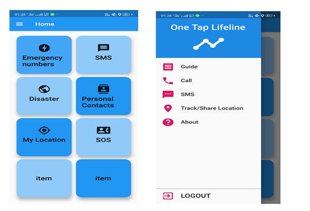
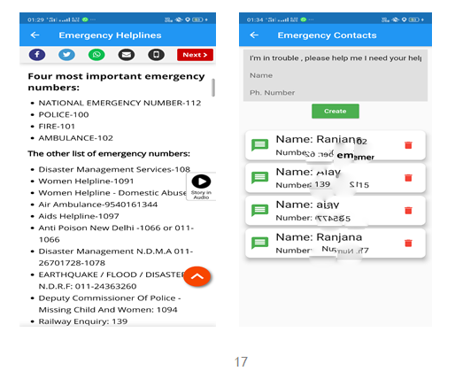
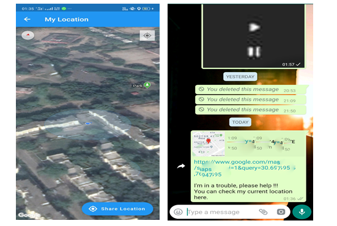
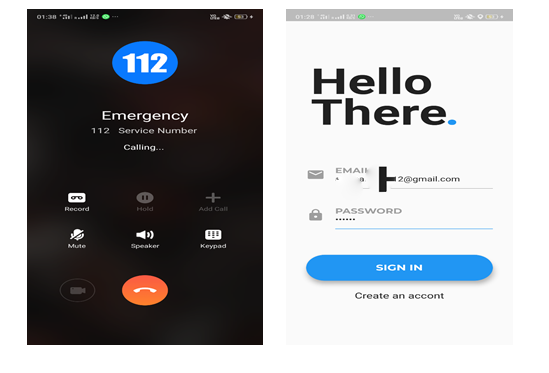

**One Tap Lifeline- Flutter Project**
-----------------------------------

The Project Uses

 - Android Studio
 - Flutter plugin in Android Studio
 - Dart
 - Java
 - Firebase
 - Google Map API

----------

Description
-----------

ONE TAP LIFELINE  is an Android app for safety purpose in emergency. This app provides different parts to cover different emergency situations.
This type of system is necessary in today’s life so that safety is ensured and help can be done faster .This could be used by every person for unwanted and undesired emergency situations.
In this app we can cover the emergency needs like hospital, fire emergency, police,etc. The app have a database to store your trusted contact and message them with your location when in trouble or call them.
This application aims to cover most of the emergency situations that a person will need and use it. Because of all possible coverage of different situations it is more feasible and more useful for people as it have most of the thing that a person will need, beacuse it makes us ready for facing problems rather than being panic.

----------

Installation
------------
 1. Install android studio
 2. Add and install Flutter Plugin
 3. Check dependecies and gradle
 4. Clone and run the project
 5. To build your own database you will need to create one using Firebase

----------

Usage
-----
Refer the following diagram to understand the flow of the application

----------

Screenshots of the Application
-------
The Sign In and Log In page of the application

The Home page and the Drawer (Build with material design)

Some helpline numbers in a web page and  another activity shows your trusted contact fetched from firebase ,you can add and delete them (Number hidden for prviacy purpose)

Your current location using google map API which can be shared to anyone easily and quickly through the app 

Calling service and logout page (email hidden for prviacy purpose)

